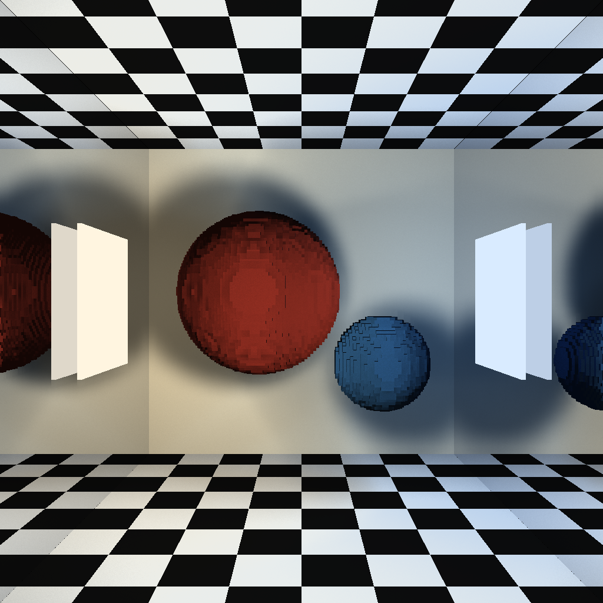
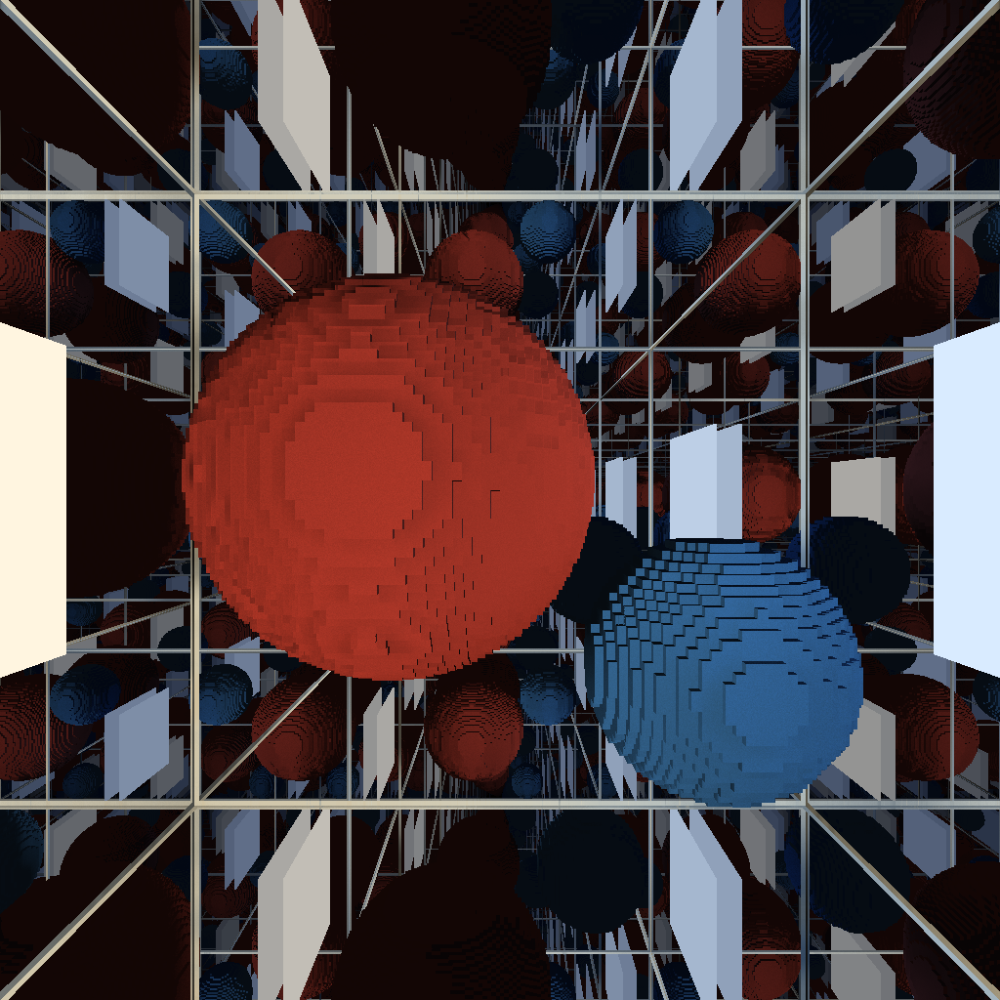
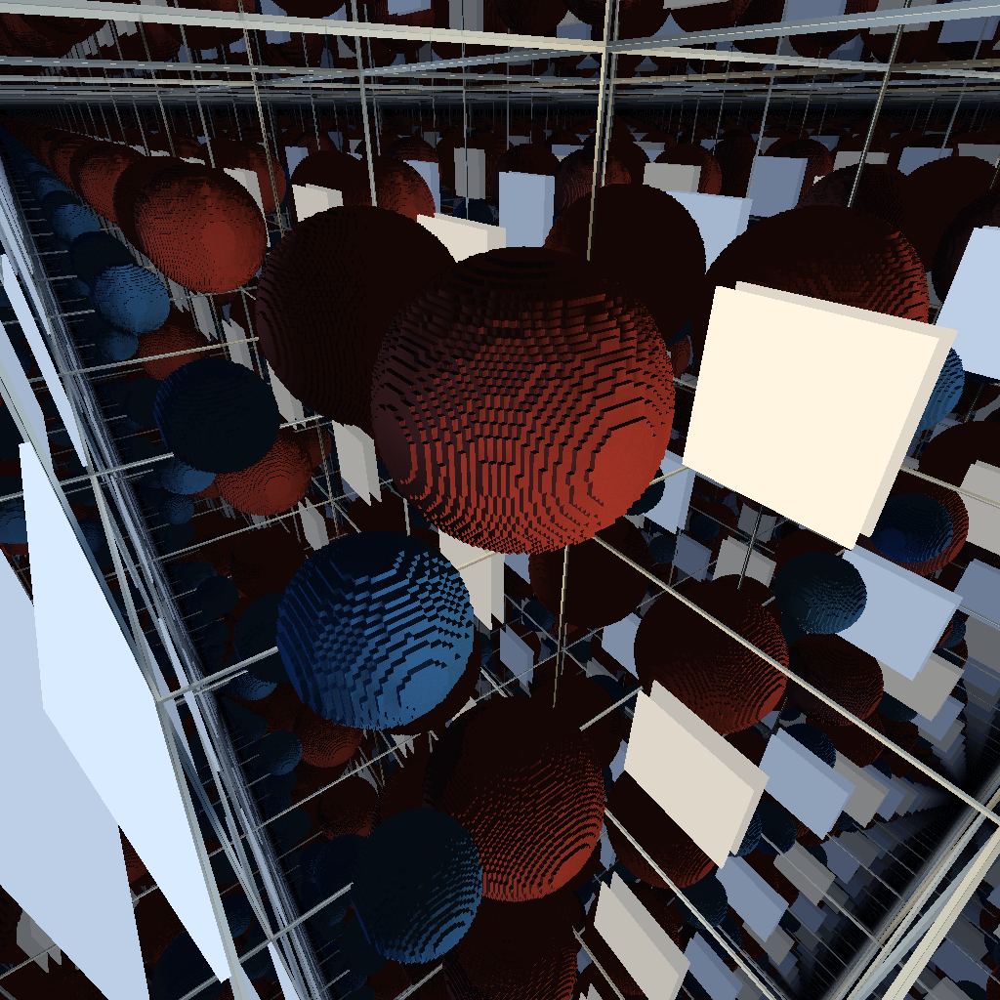

# FPGA / ASIC Voxel Ray Tracer

A 3D renderer built with Python, NumPy, and a custom SystemVerilog ray-tracing accelerator. The host software creates the scene and computes its appearance; an Artix-7 FPGA traces rays through the scene over a USB connection. The repository also contains a separate Tiny Tapeout implementation with a compact QSPI-style interface.

**Technologies:** Python · NumPy · cocotb · SystemVerilog · Artix-7 FPGA · Opal Kelly FrontPanel · Tiny Tapeout

## Example renders

Scenes from the project's rendering work, showing voxel geometry, soft shadows, colored lights, and repeated mirror reflections. These saved outputs use different scene configurations; the current defaults may produce a different view.

<p align="center">
  
</p>

| Enclosed mirror room | Mirror room from an angled camera |
|:---:|:---:|
|  |  |

## How it works

A **voxel** is a cell in a 3D grid, similar to a pixel in a 2D image. The FPGA stores one bit per cell to indicate whether it is empty or solid. The current FPGA configuration uses a **128 × 128 × 128** grid, requiring **256 KiB** of occupancy data. Colors and materials stay in host memory.

```text
Python / NumPy                    USB / FrontPanel             Artix-7 FPGA
Build scene and camera rays  ─── scene + batches of rays ───►  Walk voxel grid
Shade hits and form image    ◄── hit positions and faces ───  Return first hit
Generate shadow/reflection rays ─── repeat as needed ──────►
          │
          └── Save the final image as a PNG
```

For each ray, the hardware uses a digital differential analyzer (DDA): it steps to the next voxel boundary until it hits a solid cell, leaves the grid, or reaches a step limit. A pipelined core and scheduler keep multiple rays in progress.

Python uses the returned hit position and surface face to calculate lighting. It sends additional rays to test whether lights are blocked and to follow mirror reflections. Soft shadows come from sampling points across area lights; reflections stop at a bounce limit or when their remaining contribution becomes too small. The final image is assembled on the CPU, with a default resolution of **1024 × 1024**.

## Engineering highlights

- **Vectorized rendering:** NumPy processes camera rays, ray parameters, and lighting in arrays. Scalar implementations provide a readable reference for testing the optimized calculations.
- **Batched USB transfers:** The host submits **1,024 rays per batch** to reduce communication overhead. Batch sizes account for both input and result buffer capacities to avoid a stalled transfer.
- **Result integrity:** Pixel IDs associate results with their rays, while sequence tags help detect missing data and recover record alignment. A startup build-ID check catches incompatible FPGA bitstreams.
- **Rendering controls:** Configurable materials, lights, camera position, shadow sampling, and mirror depth. Shadow filtering smooths visibility while preserving surface boundaries.

## Verification

| Area | Checks |
|---|---|
| Rendering math | NumPy calculations against scalar references, including exact fixed-point ray parameters |
| Communication | Record encoding, transfer alignment, batch capacity, and missing or inserted result words |
| Lighting and reflections | Shadow behavior, filtering, light sample weighting, reflection direction, and bounce termination |
| Hardware | cocotb tests for the Tiny Tapeout interface; SystemVerilog testbenches for scheduling, result backpressure, and ray tags |

The [test workflow](.github/workflows/test.yaml) runs the Tiny Tapeout cocotb smoke test. The [host suite](host/tests) includes standalone checks and a Python model of hardware traversal for testing without a board.

## Getting started

### Software checks without an FPGA

Install NumPy in your Python environment:

```sh
python -m pip install numpy
```

From the repository root, set the host import path using the command for your shell:

```powershell
# PowerShell
$env:PYTHONPATH = (Resolve-Path ./host).Path
```

```sh
# Bash
export PYTHONPATH="$PWD/host"
```

Then run:

```sh
python host/tests/test_vectorised.py
python host/tests/test_framing.py
python host/tests/check_bulk.py
python host/tests/test_mirror.py
```

### Render on the FPGA

The hardware path targets an **Opal Kelly XEM7310-A75 (Artix-7)**. It requires the FrontPanel drivers and Python API (`import ok`), NumPy, and a compatible bitstream.

1. Connect the board and make the FrontPanel Python API available to your Python environment.
2. Review the `CONFIG` block in [host/render_fpga.py](host/render_fpga.py), including `BITFILE`, image size, scene, and lighting settings. The default bitstream path is `host/xem7310_raytracer_top.bit`; the host expects interface version **RTF5**.
3. Run `python host/render_fpga.py`. The script configures the FPGA, uploads the scene, traces the rays, and writes a timestamped PNG in `host/`.

The repository includes FPGA RTL and a bitstream. Rebuilding requires a separate Vivado project, Opal Kelly IP, and the block-memory configuration described in [voxel_ram.sv](src/voxel_ram.sv). The Vivado project is not included.

### Tiny Tapeout implementation

The Tiny Tapeout top module uses a separate QSPI-style ray stepper with five ray contexts and small voxel-tile caches supplied by the host on demand. Its interface differs from the FPGA's FrontPanel interface. See the [QSPI protocol](docs/qspi_stream_protocol.md) and [project configuration](info.yaml).

With Icarus Verilog and GNU Make available, run its smoke test from the repository root:

```sh
python -m pip install -r test/requirements.txt
cd test
make
```

## Repository guide

| Path | Contents |
|---|---|
| [host/render_fpga.py](host/render_fpga.py) | Scene generation, rendering math, USB communication, and PNG output |
| [host/tests/](host/tests) | Software checks, reference renders, benchmarks, and diagnostics |
| [src/](src) | FPGA wrapper, voxel traversal core, scheduler, memory, and Tiny Tapeout modules |
| [test/](test) | cocotb tests and SystemVerilog testbenches |
| [docs/qspi_stream_protocol.md](docs/qspi_stream_protocol.md) | Tiny Tapeout command and result formats |

## License

[Apache License 2.0](LICENSE).
